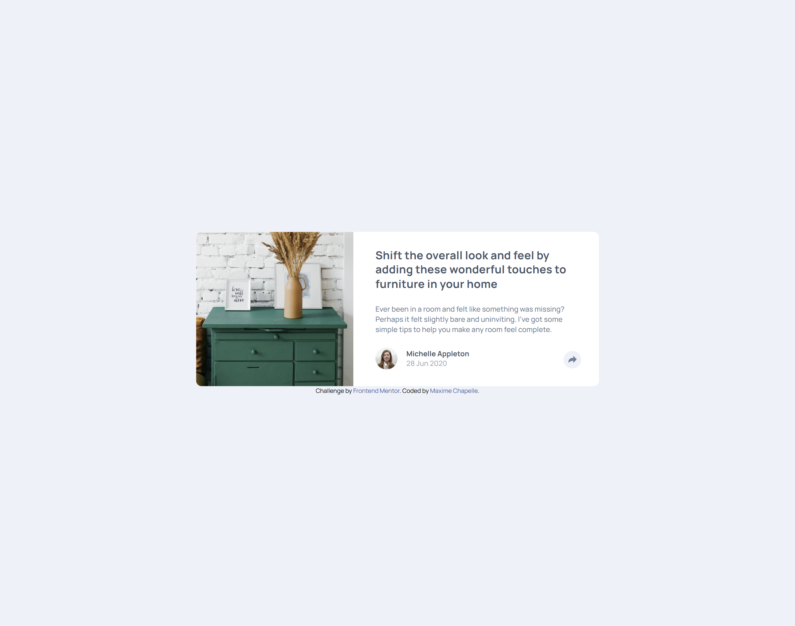
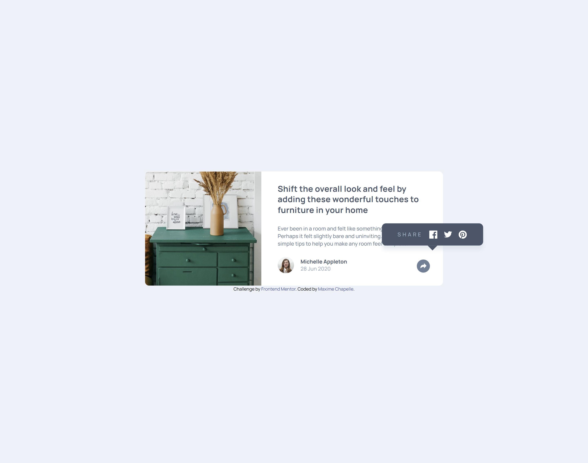

# Frontend Mentor - Article preview component solution

This is a solution to the [Article preview component challenge on Frontend Mentor](https://www.frontendmentor.io/challenges/article-preview-component-dYBN_pYFT).

## Table of contents

- [Overview](#overview)
  - [The challenge](#the-challenge)
  - [Screenshots](#screenshots)
  - [Links](#links)
- [My process](#my-process)
  - [Built with](#built-with)
  - [What I learned](#what-i-learned)
  - [Continued development](#continued-development)
  - [Useful resources](#useful-resources)
  - [AI Collaboration](#ai-collaboration)
- [Author](#author)

## Overview

### The challenge

Users should be able to:

- View the optimal layout for the component depending on their device's screen size
- See the social media share links when they click the share icon

### Screenshots

### Links

- Solution URL: [Add solution URL here](#)
- Live Site URL: [https://maxi1993-tech.github.io/article-preview-component/](https://maxi1993-tech.github.io/article-preview-component/)

## My process

### Built with

- Semantic HTML5
- CSS custom properties
- Flexbox
- SASS
- Mobile-first workflow
- A bit of JS for the share panel toggle

### What I learned

I wrote my first JS — querySelector, addEventListener and classList.toggle to show a panel on click. I also used object-fit: cover and overflow: visible for the first time.

### Continued development

I still have a lot to learn. I want to improve my JavaScript skills, write cleaner and better structured SASS, and keep refining my HTML/CSS project after project.

### Useful resources

- [MDN Web Docs](https://developer.mozilla.org) — as always, for checking CSS and JS syntax.

### AI Collaboration

Claude guided me throughout the project, but less and less as I progress. On this one, it mainly helped me understand JavaScript — querySelector, addEventListener, classList.toggle — explaining line by line without ever writing the code for me.

## Author

- Frontend Mentor - [@maxi1993-tech](https://www.frontendmentor.io/profile/maxi1993-tech)
- GitHub - [@maxi1993-tech](https://github.com/maxi1993-tech)